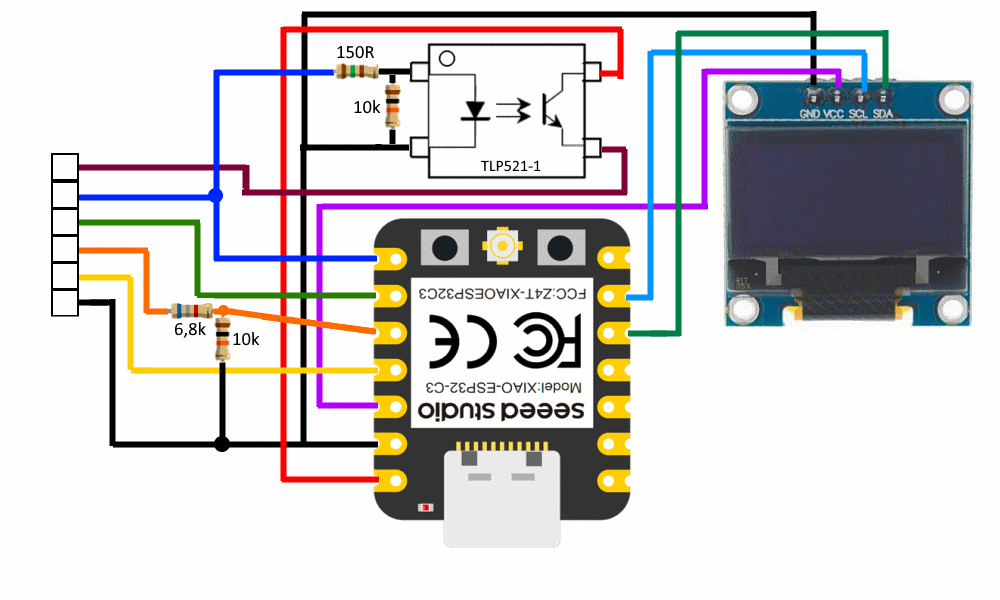
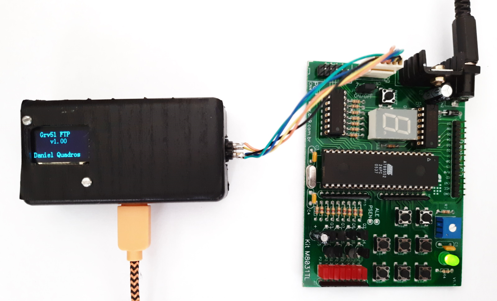

# Grv51FTP - Gravador AT89S51 e AT89S52 via FTP

Este projeto implementa em um ESP32 um servidor FTP que, ao receber um arquivo HEX, efetua a gravação de um microcontrolador AT89S51 ou AT89S52.

Nesta primeira versão o arquivo HEX recebido é gravado na Flash do ESP32, na próxima versão os dados serão extraídos para a Ram diretamente diretante a recepção e não serão mais gravados na Flash.

## Hardware

Foi usado um Xiao ESP32-C3, conectado a um display OLED I2C. Um optoacoplador TLP521-1 é usado para chavear alimentação de 5V para o microcontrolador.

Este projeto foi desenvolvido para fazer a gravação no Kit M8031TL da empresa Bit9 (já descontinuado), mas pode ser usado com outros projetos baseados nos microcontroladores AT89S5x.

## Software

O software foi desenvolvido na IDE Arduino e aproveita códigos já disponíveis:

* ESP-WiFiSettings, para a configuração do WiFi. A configuração é salva na área SPIFFS.
* Rotinas do [ATmegaDetonator](https://github.com/dquadros/ATmegaDetonator) para controle do display OLED.
* SimpleFTPServer, para implementação do servidor FTP. Fiz um [fork](https://github.com/dquadros/SimpleFTPServer) para suportar corretamente o client FTP do Windows.
* A parte de gravação propriamente dita usa as rotinas de um [outro projeto meu](https://github.com/dquadros/GravadorESP51).

Na IDE do Arduino, configurar a "Partition Scheme" para "Default 4MB with spiffs".

## Post no meu blog

https://dqsoft.blogspot.com/2023/11/kit-m8031tl-da-bit9-parte-2-gravador.html

